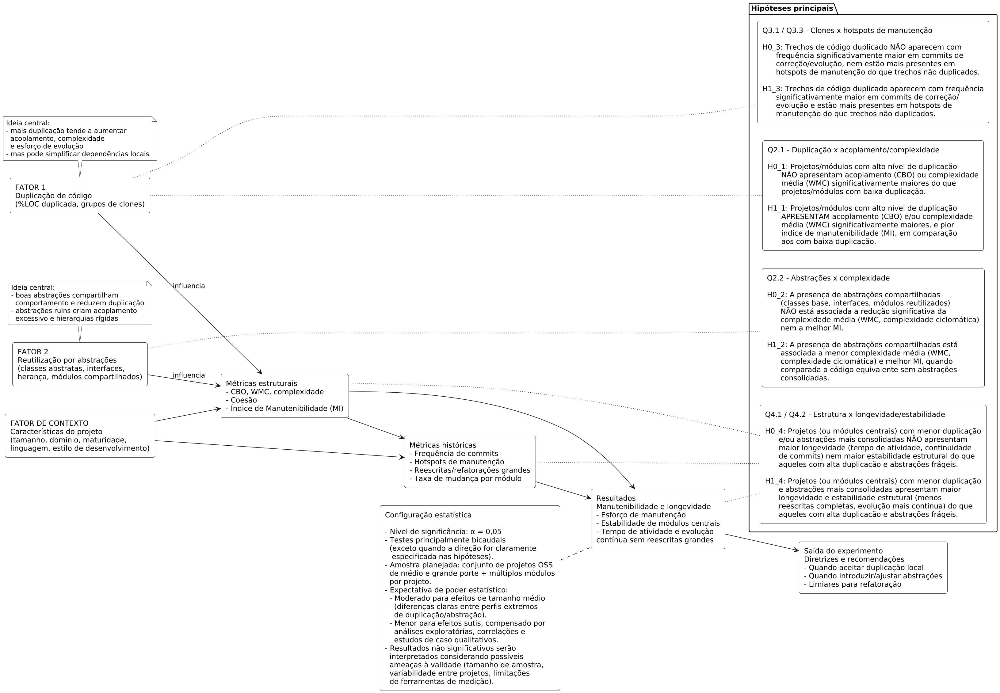
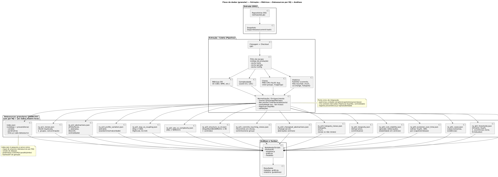

# Plano de Experimento – Scoping e Planejamento
## 1. Identificação básica
### 1.1 Título do experimento
Sustentabilidade no Desenvolvimento de Software: Uma Comparação entre Duplicação de Código e Reutilização por Abstração

### 1.2 ID / código
 ES-SUST-2025-01

### 1.3 Versão do documento e histórico de revisão
1.0 - Versão inicial do plano de experimento.

### 1.4 Datas (criação, última atualização)
- Criado em: 23 de novembro de 2025
- Última atualização: 1 de dezembro de 2025

### 1.5 Autores (nome, área, contato)
Fernando Ibrahim — fernandofibrahim@gmail.com

### 1.6 Responsável principal (PI / dono do experimento)
Fernando Ibrahim — responsável pelo desenho conceitual, hipóteses, execução e síntese dos resultados.

### 1.7 Projeto / produto / iniciativa relacionada
Este experimento está relacionado à iniciativa de pesquisa acadêmica sobre boas práticas de design de software, incluindo decisões arquiteturais que impactam manutenibilidade, custo cognitivo e sustentabilidade de longo prazo.

## 2. Contexto e problema

### 2.1 Descrição do problema / oportunidade
Este estudo investiga um dilema recorrente no desenvolvimento de software orientado a objetos: o que é mais sustentável no longo prazo, duplicar código ou reutilizá-lo por meio de abstrações? De um lado, existe a crença consolidada de que duplicação de código é sempre um “mau cheiro”, associada a inconsistências, aumento de bugs e retrabalho. De outro, abstrações são frequentemente tratadas como a solução ideal, pois promovem reaproveitamento e redução aparente de redundância. Na prática, porém, muitos esforços de abstração introduzidos apenas para eliminar duplicações acabam gerando acoplamento excessivo, interfaces genéricas demais, hierarquias profundas de classes e estruturas difíceis de evoluir. Isso é especialmente crítico em contextos ágeis, em que diferentes módulos, serviços e camadas evoluem em ritmos distintos. Em contrapartida, pequenas duplicações locais, bem delimitadas em classes ou contextos específicos, podem tornar o sistema mais previsível, legível e independente. A oportunidade deste trabalho é justamente analisar, com base em evidências e reflexão teórica, em quais cenários a duplicação controlada pode ser mais sustentável do que abstrações generalizadas, e quando o investimento em abstrações realmente se justifica, considerando a manutenibilidade, o custo cognitivo e a evolução contínua de sistemas orientados a objetos.

### 2.2 Contexto organizacional e técnico

O estudo se insere no contexto de desenvolvimento de software orientado a objetos em projetos de código aberto (OSS), mantidos em repositórios públicos como GitHub ou GitLab, nos quais código, histórico de commits, discussões técnicas e decisões de design são transparentes e construídos por comunidades distribuídas de mantenedores e contribuidores. Esses projetos costumam usar frameworks orientados a objetos, padrões de projeto, automação de build, testes, integração contínua e fluxos de contribuição baseados em pull requests e revisão de código, registrando em issues e documentos o racional por trás de refatorações, novas abstrações ou duplicações locais. Esse ambiente oferece um “laboratório natural” para observar como desenvolvedores, na prática, negociam o trade-off entre duplicação e reutilização e como essas decisões influenciam a sustentabilidade técnica e a evolução histórica dos sistemas ao longo do tempo.

### 2.3 Trabalhos e evidências prévias (internos e externos)
- Acoplamento e dificuldade de evolução [Ratzinger et al.](https://ar5iv.labs.arxiv.org/html/2502.04073)
- Duplicação de código e manutenibilidade [Eman Abdullah AlOmar.](https://ar5iv.labs.arxiv.org/html/2502.04073)
- CK Metrics: [Chidamber & Kemerer, 1994](https://ieeexplore.ieee.org/document/1191795)

### 2.4 Referencial teórico e empírico essencial
Teoria de métricas de software orientadas a objetos: parte do princípio de que é possível medir propriedades estruturais do código (como acoplamento, coesão, complexidade e herança) e relacioná-las a atributos de qualidade como manutenibilidade e propensão a defeitos, seguindo a linha de CK Metrics e modelos posteriores.

Conceitos de modularidade, acoplamento e coesão: a partir de Parnas e da engenharia de software clássica, o experimento se apoia na ideia de que módulos fracamente acoplados e altamente coesos são mais fáceis de entender, testar e modificar, servindo como base para avaliar o impacto de abstrações e duplicações na evolução do sistema.

Princípios de design OO (DRY, SRP, encapsulamento): princípios como Don’t Repeat Yourself e Responsabilidade Única estruturam a discussão sobre o papel da duplicação e da abstração. Abstrações bem definidas e encapsuladas tendem a concentrar conhecimento em pontos únicos, enquanto violações de DRY e classes com múltiplas responsabilidades indicam problemas de design e maior risco de dívida técnica.

Duplicação de código e code clones: a literatura de code clones fornece o embasamento teórico para tratar duplicação como fenômeno mensurável e recorrente em sistemas OO, permitindo discutir quando a eliminação de clones por abstração melhora a manutenibilidade e quando a duplicação local pode ser um compromisso aceitável ou até desejável.

Sustentabilidade técnica e dívida técnica em OSS: o conceito de sustentabilidade técnica integra manutenibilidade, simplicidade, clareza e custo de evolução ao longo do tempo. Estudos sobre dívida técnica em projetos OSS mostram como decisões de design (incluindo abstrações excessivas ou duplicação descontrolada) se acumulam e impactam a evolução histórica do sistema, servindo como base empírica para formular e testar as hipóteses deste experimento.

## 3. Objetivos e questões (Goal / Question / Metric)

### 3.1 Objetivo geral (Goal template)
O objetivo geral deste estudo, seguindo o template GQM, é analisar padrões de duplicação de código e reutilização por abstrações em sistemas de software orientados a objetos de código aberto, com o propósito de avaliar seu impacto na manutenibilidade, no histórico de mudanças e na longevidade do software, com respeito a indicadores estruturais como acoplamento, complexidade e ocorrência de clones, sob a perspectiva de pesquisadores e engenheiros de software interessados em boas práticas de design, no contexto de projetos OSS de médio e grande porte mantidos colaborativamente em repositórios públicos.

### 3.2 Objetivos específicos
- O1 – Caracterizar o cenário atual
Identificar e descrever o perfil de duplicação de código e de reutilização por abstrações em um conjunto de projetos OSS orientados a objetos (por exemplo, volume de clones, uso de classes abstratas, interfaces, hierarquias de herança e módulos reutilizáveis).
- O2 – Relacionar estrutura e manutenibilidade
Investigar a correlação entre níveis de duplicação/abstração e métricas estruturais de manutenibilidade, como acoplamento, complexidade de classes e coesão, buscando evidências de quais padrões tornam o código mais ou menos fácil de manter.
- O3 – Conectar padrões estruturais ao histórico de mudanças
Analisar como a presença de duplicação de código e de abstrações compartilhadas se reflete no histórico de mudanças dos projetos (frequência de modificações, arquivos frequentemente alterados em conjunto, hotspots de manutenção).
- O4 – Explorar impacto na longevidade do software
Avaliar em que medida diferentes combinações de duplicação e abstração parecem influenciar a longevidade e a evolução contínua dos projetos (por exemplo, sobrevivência de módulos, evolução de componentes centrais, acúmulo de débito técnico).
- O5 – Derivar recomendações práticas
Sintetizar, a partir dos resultados empíricos, recomendações para apoiar desenvolvedores e arquitetos na decisão entre manter duplicações locais ou introduzir novas abstrações, considerando manutenibilidade, histórico de mudanças e sustentabilidade de longo prazo.

### 3.3 Questões de pesquisa / de negócio

**O1 – Caracterizar o cenário atual**

Identificar e descrever o perfil de duplicação de código e de reutilização por abstrações em um conjunto de projetos OSS orientados a objetos.

Questões associadas:

- **Q1.1:** Qual é o nível de duplicação de código (proporção de clones, quantidade de grupos de clones) nos projetos analisados?  
- **Q1.2:** Quais mecanismos de abstração são mais utilizados (classes abstratas, interfaces, hierarquias de herança, módulos utilitários reutilizados) nesses projetos?  
- **Q1.3:** Como esses padrões de duplicação e abstração variam entre projetos de diferentes tamanhos, domínios e níveis de maturidade?

**O2 – Relacionar estrutura e manutenibilidade**

Investigar a correlação entre níveis de duplicação/abstração e métricas estruturais de manutenibilidade.

Questões associadas:

- **Q2.1:** Projetos com maior duplicação de código apresentam maior acoplamento entre módulos do que projetos com menos duplicação?  
- **Q2.2:** A presença de abstrações compartilhadas está associada a menor complexidade média de classes e métodos (por exemplo, menor WMC, menor complexidade ciclomática)?  
- **Q2.3:** Quais combinações de métricas estruturais (duplicação, abstração, acoplamento, coesão) estão mais fortemente associadas a melhores indicadores de manutenibilidade?

---

**O3 – Conectar padrões estruturais ao histórico de mudanças**

Analisar como duplicação e abstrações se refletem no histórico de mudanças dos projetos.

Questões associadas:

- **Q3.1:** Trechos de código duplicado tendem a aparecer com maior frequência em commits de correção ou evolução do que trechos não duplicados?  
- **Q3.2:** Arquivos que contêm abstrações centrais (classes base, interfaces, módulos compartilhados) aparecem com que frequência em commits que envolvem múltiplos módulos ao mesmo tempo?  
- **Q3.3:** Existem evidências de que clones de código estão associados a “hotspots” de manutenção, isto é, áreas do sistema com alta taxa de mudanças ao longo do tempo?

---

**O4 – Explorar impacto na longevidade do software**

Avaliar em que medida padrões de duplicação/abstração parecem influenciar longevidade e evolução contínua dos projetos.

Questões associadas:

- **Q4.1:** Projetos com menores níveis de duplicação de código e/ou com abstrações mais consolidadas apresentam maior longevidade em termos de tempo de atividade e continuidade de commits?  
- **Q4.2:** Módulos centrais que adotam abstrações bem definidas permanecem mais tempo estáveis (com menos reescritas completas) do que módulos com alto nível de duplicação?  
- **Q4.3:** Há indícios de que a redução de duplicação e de acoplamento ao longo da história do projeto esteja associada à sua capacidade de continuar evoluindo sem grandes reescritas (rewrites) ou abandonos?

---

**O5 – Derivar recomendações práticas**

Sintetizar recomendações para apoiar decisões entre manter duplicações locais ou introduzir abstrações.

Questões associadas:

- **Q5.1:** Em quais cenários observados (tipo de módulo, frequência de mudança, criticidade) a duplicação controlada se mostrou um compromisso mais vantajoso do que a criação de novas abstrações?  
- **Q5.2:** Existem limiares quantitativos (por exemplo, nível de duplicação, grau de acoplamento, número de ocorrências de um clone) a partir dos quais a refatoração em direção a uma abstração compartilhada passa a ser claramente recomendada?  
- **Q5.3:** Que diretrizes práticas podem ser propostas para que desenvolvedores e arquitetos decidam quando aceitar duplicação local e quando investir na criação ou melhoria de abstrações compartilhadas?

### 3.4 Métricas associadas (GQM)

| O  | Q    | M (Métricas associadas – mínimo 2 por questão)                                                                 |
|----|------|-----------------------------------------------------------------------------------------------------------------|
| O1 | Q1.1 – Nível de duplicação de código nos projetos | - **%LOC duplicada** (proporção de linhas de código clonadas no projeto)    - **Grupos de clones** (quantidade de grupos de clones identificados) |
| O1 | Q1.2 – Uso de mecanismos de abstração | - **Classes abstratas** (contagem de classes abstratas por projeto)   - **Interfaces** (contagem de interfaces por projeto) |
| O1 | Q1.3 – Variação de duplicação/abstração por tipo de projeto | - **%LOC duplicada por categoria** (tamanho, domínio, maturidade)   - **Abstrações/LOC** ((classes abstratas + interfaces) normalizado por LOC) |
| O2 | Q2.1 – Relação entre duplicação e acoplamento | - **CBO médio** (Coupling Between Objects) em grupos com alta vs. baixa duplicação   - **%LOC duplicada** (usada para segmentar os grupos comparados) |
| O2 | Q2.2 – Relação entre abstrações e complexidade | - **WMC médio** (Weighted Methods per Class) de classes com e sem abstrações   - **Complexidade ciclomática média** dos métodos por classe |
| O2 | Q2.3 – Estrutura x manutenibilidade | - **Índice de manutenibilidade (MI)** do projeto/módulo   - **Correlação entre (%LOC duplicada, CBO, WMC) e MI** |
| O3 | Q3.1 – Frequência de mudanças em código duplicado | - **%Commits tocando clones** (commits que modificam pelo menos um clone)   - **Commits por grupo de clone** (quantidade média de commits por grupo) |
| O3 | Q3.2 – Impacto de alterações em abstrações centrais | - **Commits que alteram arquivos de abstração** (classes base/interfaces)   - **Tamanho médio do change set** em commits que alteram abstrações (arquivos por commit) |
| O3 | Q3.3 – Clones e hotspots de manutenção | - **Hotspots contendo clones** (arquivos/regiões com alta taxa de mudanças + clones)   - **Taxa de mudança em regiões clonadas vs. não clonadas** (mudanças/LOC) |
| O4 | Q4.1 – Duplicação/abstração e longevidade do projeto | - **Tempo de atividade do projeto** (entre primeiro e último commit significativo)   - **Taxa média de commits** (commits por ano) por perfil estrutural |
| O4 | Q4.2 – Estabilidade de módulos centrais | - **Reescritas completas / grandes refatorações** em módulos centrais   - **CBO médio de módulos centrais** (comparando perfis com alta abstração vs. alta duplicação) |
| O4 | Q4.3 – Evolução estrutural ao longo do tempo | - **Variação da %LOC duplicada por release**   - **Variação do CBO médio por release** |
| O5 | Q5.1 – Cenários onde duplicação controlada é vantajosa | - **Casos de estudo analisados** (duplicação mantida vs. abstração introduzida)   - **%Defeitos relacionados a clones vs. abstrações** |
| O5 | Q5.2 – Limiares para recomendar refatoração | - **Limiar de ocorrências de clone** (número de repetições a partir do qual se recomenda abstrair)   - **Limiar de %LOC duplicada por módulo** (acima do qual o módulo é candidato à refatoração) |
| O5 | Q5.3 – Diretrizes práticas para decisão | - **Guidelines derivadas do estudo** (regras de decisão documentadas)   - **% PRs históricos que se encaixariam nas guidelines (estimado)** |

### 4. Escopo e contexto do experimento  

#### 4.1 Escopo funcional / de processo (incluído e excluído)  

O experimento tem como escopo principal a análise estrutural de código fonte em sistemas orientados a objetos de código aberto, com foco específico em aspectos de duplicação de código e reutilização por abstrações. Serão incluídos no estudo os módulos e artefatos que representam o **código de produção**: classes de domínio, serviços, adaptadores, utilitários e componentes centrais que participam diretamente da lógica do sistema. As atividades cobertas concentram-se em **extração de métricas estáticas**, detecção de clones, análise de histórico de mudanças em sistemas de controle de versão e interpretação dos resultados à luz da literatura de engenharia de software.

Ficam explicitamente **fora do escopo** atividades de intervenção direta nas equipes ou nos processos organizacionais dos projetos OSS analisados, bem como qualquer alteração no fluxo de desenvolvimento desses projetos. Também serão excluídos: código meramente gerado automaticamente (stubs, código de ferramentas), scripts de infraestrutura, arquivos de configuração e, salvo uso pontual como evidência complementar, **testes automatizados**, uma vez que o foco do estudo está nas decisões de design do código de produção. Processos internos de empresas que eventualmente usam esses projetos também não são objeto de investigação; o experimento se restringe ao que está disponível publicamente nos repositórios.  

---

#### 4.2 Contexto do estudo (tipo de organização, projeto, experiência)  

O estudo será conduzido no contexto de **projetos de software de código aberto**, hospedados em plataformas públicas como GitHub ou GitLab, mantidos por comunidades distribuídas de desenvolvedores. Esses projetos variam de pequeno a grande porte, abrangendo diferentes domínios de aplicação (por exemplo, bibliotecas, frameworks, serviços de backend) e diferentes níveis de maturidade (projetos mais recentes e projetos com longa história de evolução).

Do ponto de vista organizacional, trata-se de um ambiente **descentralizado e colaborativo**, no qual não há uma única empresa controlando o processo, mas sim mantenedores principais, contribuidores frequentes e participantes ocasionais. Os “participantes” do estudo, no sentido de agentes ativos, são os pesquisadores e engenheiros de software responsáveis por coletar, extrair e interpretar as métricas; os desenvolvedores OSS atuam como sujeitos indiretos, na medida em que suas decisões de design constituem o objeto de análise. Pressupõe-se um público com experiência variada em desenvolvimento orientado a objetos, padrões de projeto e práticas de refatoração, refletida no próprio código e na qualidade estrutural dos projetos analisados.  

---

#### 4.3 Premissas  

O plano do experimento se apoia em algumas premissas fundamentais. Assume-se que:  

1. **Os repositórios OSS selecionados permanecerão acessíveis** e com histórico de commits íntegro durante todo o período de coleta e análise.  
2. As **ferramentas de análise estática e detecção de clones** escolhidas serão capazes de processar o código orientado a objetos com precisão razoável, identificando classes, interfaces, clones e métricas como CBO e WMC.  
3. O histórico de mudanças (commits, tags, mensagens e, quando possível, issues) é **suficientemente consistente** para permitir inferências sobre evolução, hotspots e longevidade do software.  
4. As **métricas estruturais** adotadas (duplicação, acoplamento, complexidade, etc.) são bons proxies para atributos de manutenibilidade, mesmo que não capturem todos os aspectos qualitativos envolvidos.  
5. A seleção de projetos OSS será **minimamente diversificada**, de modo a abranger diferentes domínios e tamanhos, permitindo comparações significativas.  

Essas premissas não podem ser garantidas de forma absoluta, mas são consideradas plausíveis para viabilizar o estudo.  

---

#### 4.4 Restrições  

O experimento também está sujeito a restrições práticas. O **tempo disponível** para coleta, processamento e análise de dados limita a quantidade de projetos e o grau de profundidade com que cada um pode ser estudado. Existem restrições de **infraestrutura computacional**, especialmente para processar repositórios grandes com ferramentas de detecção de clones e cálculo de métricas em múltiplos snapshots históricos.

Há, ainda, limitações relacionadas às **ferramentas escolhidas**: cada analisador estático possui seus próprios limites de linguagem, versão, escala e precisão. Alterações nas APIs das plataformas de hospedagem de código ou limitações de taxa (rate limiting) podem restringir o acesso automatizado a dados. Finalmente, o estudo é conduzido sem intervenção formal nas comunidades dos projetos, o que significa que não é possível aplicar questionários ou entrevistas para complementar a interpretação das métricas com percepção subjetiva dos desenvolvedores dentro do escopo inicial.  

---

#### 4.5 Limitações previstas  

Alguns fatores podem comprometer a **generalização dos resultados**. Em primeiro lugar, o foco em projetos de código aberto implica que as conclusões podem não se transferir integralmente para contextos de software proprietário, nos quais processos, restrições e pressões de negócio são diferentes. Em segundo lugar, a **amostra de projetos** provavelmente não será completamente representativa de todos os tipos de sistemas orientados a objetos, o que limita a validade externa.

Além disso, a interpretação de **métricas estruturais e históricas** está sujeita a ameaças de validade: correlações observadas entre duplicação, abstração, acoplamento e manutenibilidade podem ser influenciadas por fatores não controlados, como estilo de desenvolvimento, qualidade das revisões de código ou mudanças na equipe ao longo do tempo. Por fim, as ferramentas de análise podem introduzir **erros de medição**, seja ao detectar clones, seja ao calcular métricas orientadas a objetos, o que precisa ser considerado ao interpretar os resultados.  

---

### 5. Stakeholders e impacto esperado  

#### 5.1 Stakeholders principais  

Os principais stakeholders deste estudo são:  

- **Pesquisadores e estudantes de engenharia de software**, interessados em evidências empíricas sobre o impacto de duplicação e abstração na manutenibilidade e longevidade de sistemas.  
- **Desenvolvedores e mantenedores de projetos OSS**, cujas decisões de design podem ser diretamente informadas pelas recomendações produzidas.  
- **Arquitetos de software e líderes técnicos**, responsáveis por definir diretrizes de design, padrões de refatoração e estratégias de reutilização de código em sistemas orientados a objetos.  
- **Gestores de produto e de engenharia**, que precisam equilibrar investimento em refatorações estruturais com demandas de entrega de novas funcionalidades.  

---

#### 5.2 Interesses e expectativas dos stakeholders  

Pesquisadores esperam obter **resultados quantitativos e qualitativos sólidos**, que avancem o entendimento científico sobre trade-offs entre duplicação e abstração e possam gerar publicações ou novos estudos. Desenvolvedores e mantenedores buscam **orientações práticas e exemplos concretos**, que os ajudem a decidir, na rotina do projeto, quando compensa introduzir uma abstração ou aceitar duplicação local.

Arquitetos e líderes técnicos esperam **evidências que sustentem decisões arquiteturais** de médio e longo prazo, especialmente no que diz respeito à organização modular dos sistemas, ao controle de acoplamento e à priorização de refatorações. Já gestores têm interesse em **indicadores que justifiquem ou não investir em melhorias estruturais**, com impacto em qualidade, risco técnico, produtividade e longevidade do produto. Em síntese, todos os grupos buscam **reduzir incerteza** na tomada de decisão relacionada a design de código.  

---

#### 5.3 Impactos potenciais no processo / produto  

A execução do experimento pode gerar impactos diretos e indiretos nos projetos analisados. No curto prazo, a simples identificação de áreas com alta duplicação, acoplamento ou complexidade pode motivar mantenedores a **abrir issues ou propor refatorações**, o que aumenta temporariamente a carga de trabalho focada em qualidade estrutural. Isso pode afetar prazos de entrega caso as refatorações sejam priorizadas.

Por outro lado, a médio e longo prazo, espera-se que a aplicação das recomendações produzidas pelo estudo contribua para **reduzir defeitos recorrentes**, diminuir o esforço de manutenção e tornar o fluxo de desenvolvimento mais previsível. No nível do produto, mudanças em abstrações centrais, eliminação de clones ou reorganização modular podem alterar a estrutura interna sem alterar, necessariamente, o comportamento funcional visível para usuários finais, mas com impactos relevantes em **qualidade interna, robustez e capacidade de evolução**.  

---

### 6. Riscos de alto nível, premissas e critérios de sucesso  

#### 6.1 Riscos de alto nível (negócio, técnicos, etc.)  

Entre os principais riscos técnicos, destacam-se:  

- **Indisponibilidade ou alteração dos repositórios OSS** durante a coleta de dados, comprometendo a replicação ou continuidade das análises.  
- **Falhas ou limitações das ferramentas de análise estática e detecção de clones**, que podem impedir o processamento adequado de alguns projetos ou introduzir distorções nas métricas.  
- **Problemas de desempenho e escala**, especialmente ao analisar projetos muito grandes ou múltiplos snapshots históricos.  

Do ponto de vista de “negócio” da pesquisa, há o risco de que os dados coletados não revelem relações claras entre duplicação, abstração e manutenibilidade, resultando em evidências fracas ou inconclusivas. Existe ainda o risco de **interpretações simplistas** dos resultados que ignorem o contexto particular de cada projeto, levando a recomendações exageradamente genéricas.  

---

#### 6.2 Critérios de sucesso globais (go / no-go)  

O experimento será considerado **bem-sucedido** se:  

1. For possível coletar, para um conjunto significativo de projetos, **métricas estruturais confiáveis** (duplicação, abstração, acoplamento, complexidade) e dados históricos básicos.  
2. As análises produzirem **respostas claras ou, ao menos, informativas** às principais questões de pesquisa, ainda que nem todas confirmem hipóteses iniciais.  
3. O estudo gerar um conjunto de **recomendações ou diretrizes práticas** minimamente aplicáveis por desenvolvedores e arquitetos em contextos semelhantes.  

Do ponto de vista de decisão (go/no-go), o experimento sustenta um “go” para mudanças (por exemplo, políticas de refatoração, guidelines de duplicação/abstração) quando as evidências indicarem de forma consistente que certos padrões estruturais se relacionam a melhor manutenibilidade e longevidade, ou quando ficarem claros os contextos em que duplicação ou abstração são mais adequadas. Um “no-go” seria recomendado se os resultados forem muito ruidosos, contraditórios ou claramente insuficientes para embasar qualquer decisão.  

---

#### 6.3 Critérios de parada antecipada (pré-execução)  

O experimento deverá ser adiado ou cancelado antes do início efetivo da coleta e análise de dados se ocorrerem algumas das seguintes situações:  

- **Indisponibilidade de recursos críticos**, como ferramentas de análise (detector de clones, extratores de métricas) ou infraestrutura computacional minimamente adequada.  
- **Impossibilidade de acesso estável aos repositórios** selecionados, seja por remoção, mudança de visibilidade ou restrições de acesso.  
- **Mudanças substanciais no escopo ou nos objetivos do estudo** que tornem o desenho atual inadequado, exigindo uma reformulação completa.  

Adicionalmente, se testes preliminares indicarem que as ferramentas escolhidas não conseguem processar de forma confiável os projetos-alvo (por exemplo, falhas sistemáticas, resultados incoerentes), isso configura um motivo forte para interromper ou redesenhar o experimento antes de investir esforço significativo. Esses critérios de parada antecipada existem para evitar o prosseguimento de um estudo que, dadas as condições, não terá condições de produzir resultados com a qualidade científica e a utilidade prática desejadas.

### 7. Modelo conceitual e hipóteses
#### 7.1 Modelo conceitual do experimento

### 7.2 Hipóteses formais (H0, H1)

A seguir estão as hipóteses nulas e alternativas resumidas para as **questões principais** do experimento, agrupadas por objetivo.

- **O2 – Estrutura x manutenibilidade**

  - **H0\_O2 (nula)**  
    Não existe relação estatisticamente significativa entre os níveis de duplicação de código / uso de abstrações e os indicadores de manutenibilidade (por exemplo, CBO, WMC, complexidade ciclomática, MI).

  - **H1\_O2 (alternativa, direção esperada)**  
    Maior duplicação de código está associada a:
    - maior acoplamento (CBO) e maior complexidade (WMC, complexidade ciclomática); e  
    - menor índice de manutenibilidade (MI);  
    enquanto o uso de abstrações bem definidas está associado a menor complexidade média e maior MI.

---

- **O3 – Estrutura x histórico de mudanças**

  - **H0\_O3 (nula)**  
    Clones de código e abstrações centrais **não** apresentam comportamento de mudança (frequência de commits, tamanho de change sets, hotspots) significativamente diferente do restante do código.

  - **H1\_O3 (alternativa, direção esperada)**  
    - Regiões com código duplicado aparecem com **maior frequência** em commits de correção/evolução e em **hotspots de manutenção** (maior taxa de mudanças por LOC) do que regiões não clonadas; e  
    - Commits que alteram abstrações centrais tendem a ter **change sets maiores** (mais arquivos modificados), indicando maior propagação de impacto.

---

- **O4 – Estrutura x longevidade / estabilidade**

  - **H0\_O4 (nula)**  
    Perfis estruturais com menor duplicação e/ou abstrações mais consolidadas **não estão associados** a maior longevidade dos projetos, maior continuidade de commits nem maior estabilidade de módulos centrais.

  - **H1\_O4 (alternativa, direção esperada)**  
    - Projetos com **menor %LOC duplicada** e abstrações mais consolidadas tendem a apresentar **maior longevidade** (permanecem ativos por mais tempo) e **evolução mais contínua** (taxa de commits mais estável); e  
    - Módulos centrais com boas abstrações sofrem **menos reescritas completas / grandes refatorações** e possuem **CBO médio menor** do que módulos centrais com alto nível de duplicação.

---

- **O1 e O5 – Natureza descritiva/exploratória**

  Para **O1** (caracterizar cenário atual) e **O5** (derivar recomendações), a análise será predominantemente **descritiva e exploratória**, usando estatística descritiva e estudos de caso para identificar perfis, padrões e possíveis limiares práticos. Não são definidas hipóteses globais H0/H1 únicas para esses objetivos; em vez disso, resultados quantitativos e qualitativos serão combinados para formular guidelines.

---

### 7.3 Nível de significância e considerações de poder

- **Nível de significância adotado:**  
  \[
  \alpha = 0{,}05
  \]

Serão usados, em geral, **testes bicaudais**, por serem mais conservadores, ainda que as hipóteses alternativas tenham uma **direção teórica esperada** (por exemplo, “mais duplicação → pior manutenibilidade”). Sempre que possível, serão reportados também:

- **Tamanho de efeito** (por exemplo, d de Cohen, coeficientes de correlação);  
- **Intervalos de confiança**, para explicitar a incerteza das estimativas.

Do ponto de vista de poder estatístico:

- A análise em nível de **módulo/arquivo** (muitas observações por projeto) deve fornecer **poder moderado a alto** para detectar **efeitos de tamanho médio** nas relações duplicação/abstração x métricas estruturais (CBO, WMC, MI).  
- A análise em nível de **projeto** (menos unidades) terá poder menor para efeitos sutis, exigindo interpretação mais cautelosa.

Para mitigar limitações de poder, o estudo irá:
1. Combinar diferentes granularidades (módulo, arquivo, projeto).  
2. Complementar os testes com **estudos de caso qualitativos** (projetos/módulos extremos).  
3. Dar ênfase em **tamanhos de efeito** e relevância prática, não apenas em significância estatística.

Em síntese, com um conjunto de projetos OSS de médio/grande porte e múltiplos módulos por projeto, espera-se poder estatístico suficiente para detectar efeitos moderados nas principais relações investigadas.

## 8. Variáveis, fatores, tratamentos e objetos de estudo

### 8.1 Objetos de estudo

- **Projetos OSS OO:** repositórios completos em GitHub/GitLab.  
- **Módulos/arquivos de produção:** classes, pacotes, serviços, adaptadores, utilitários.  
- **Regiões específicas de código:** grupos de clones e arquivos com abstrações centrais.  
- **Snapshots históricos:** releases ou versões em pontos relevantes da linha do tempo.

### 8.2 Sujeitos / participantes

- **Pesquisadores / engenheiros de software:** responsáveis por seleção de projetos, execução de ferramentas e análise de resultados.  
- **Desenvolvedores OSS:** participantes indiretos; suas decisões de design são observadas através do código e histórico de commits.

### 8.3 Variáveis independentes (fatores) e níveis

- **Duplicação de código (Dup):** %LOC duplicada, nº de grupos de clones.  
  - Níveis: **Baixo / Médio / Alto** (definidos por faixas).  

- **Reutilização por abstrações (Abs):** nº de classes abstratas, interfaces, módulos utilitários, centralidade.  
  - Níveis: **Baixo / Médio / Alto**.  

- **Papel estrutural do módulo (Role):**  
  - Níveis: **Central / Periférico**.  

- **Perfil de projeto (ProjectProfile):**  
  - Tamanho: pequeno / médio / grande.  
  - Maturidade: baixa / média / alta.  
  - Domínio: biblioteca/framework / aplicação / ferramenta de infra.

### 8.4 Tratamentos (condições experimentais)

Perfis estruturais observados (não há intervenção experimental clássica):

- **T1 – Alta abstração, baixa duplicação (Abs↑, Dup↓)**  
- **T2 – Baixa abstração, baixa duplicação (Abs↓, Dup↓)**  
- **T3 – Alta duplicação, baixa abstração (Abs↓, Dup↑)**  
- **T4 – Alta duplicação, alta abstração (Abs↑, Dup↑)**  

Comparações binárias adicionais: **HighDup vs. LowDup**, **HighAbs vs. LowAbs**, **Central vs. Periférico**.

### 8.5 Variáveis dependentes (respostas)

- **Estruturais:** CBO médio, WMC médio, complexidade ciclomática, MI.  
- **Histórico de mudanças:** %commits tocando clones, commits/clone, tamanho do change set em commits que alteram abstrações, taxa de mudança em regiões clonadas vs. não clonadas.  
- **Longevidade:** tempo de atividade do projeto, taxa média de commits por ano, nº de grandes refatorações/reescritas em módulos centrais.  
- **Qualidade / recomendações:** distribuição (quando possível) de defeitos em clones vs. abstrações; evidências de casos de estudo.

### 8.6 Variáveis de controle / bloqueio

- **Linguagem predominante:** estratificação por Java, C#, C++ etc.  
- **Tamanho do projeto:** faixas de LOC/nº de arquivos.  
- **Maturidade:** idade, nº de releases, popularidade.  
- **Tipo de projeto:** biblioteca, framework, aplicação de negócio, ferramenta.  
- **Granularidade de análise:** foco consistente em código de produção (excluindo testes, código gerado, scripts).

Essas variáveis podem ser usadas como blocos ou covariáveis em análises estatísticas.

### 8.7 Possíveis variáveis de confusão

- Estilo de desenvolvimento e cultura de revisão/refatoração da equipe.  
- Qualidade e cobertura de testes automatizados.  
- Uso intenso de frameworks e código gerado, que pode inflar métricas de acoplamento.  
- Mudanças de equipe / governança ao longo do tempo.  
- Diferenças na forma de registrar issues e bugs.  
- Histórico prévio de grandes refatorações (podem “resetar” o perfil estrutural).

Esses fatores serão monitorados, sempre que possível, por inspeção qualitativa de documentação, issues e histórico, e levados em conta na interpretação dos resultados.

### 9. Desenho experimental  

#### 9.1 Tipo de desenho  

O estudo é **observacional, retrospectivo e quase-experimental**, baseado em dados históricos de projetos OSS.  
O desenho é essencialmente **fatorial 2×2 entre grupos**, com dois fatores principais:

- Nível de **duplicação de código** (baixo vs. alto)  
- Nível de **abstração/reutilização** (baixo vs. alto)  

Há ainda **bloqueio por contexto** (tamanho, domínio, maturidade) para reduzir viés entre projetos. Esse desenho é adequado porque permite observar o efeito conjunto de duplicação e abstração em dados reais, sem intervir nos projetos.

---

#### 9.2 Randomização e alocação  

Não há randomização clássica de tratamento, mas sim:

- **Seleção aleatória de projetos OSS** dentro de um conjunto elegível (critérios mínimos de linguagem OO, tamanho, histórico).  
- **Classificação automática** de projetos/módulos em faixas de duplicação e abstração, seguida de **amostragem aleatória estratificada** para compor grupos comparáveis.  
- **Ordem de processamento/inspeção** (para estudos de caso) também randomizada para reduzir viés do pesquisador.

---

#### 9.3 Balanceamento e contrabalanço  

**Balanceamento**

- Uso de **estratificação** por tamanho, domínio e maturidade de projeto ao formar grupos (alta vs. baixa duplicação / abstração).  
- Limite de módulos por projeto nos grupos, com **amostragem aleatória** interna, evitando que um único projeto domine os resultados.  

**Contrabalanço**

- Nas análises qualitativas, a **ordem de inspeção** dos casos (alta/baixa duplicação/abstração) será alternada/sorteada.  
- Se houver mais de um avaliador, casos de diferentes grupos serão distribuídos **cruzadamente** para reduzir viés individual.

---

#### 9.4 Número de grupos e sessões  

**Grupos (fatorial 2×2)**

- **G1 – Alta duplicação / Baixa abstração**  
- **G2 – Baixa duplicação / Alta abstração**  
- **G3 – Alta duplicação / Alta abstração**  
- **G4 – Baixa duplicação / Baixa abstração**  

Esses quatro perfis permitem avaliar efeitos principais (duplicação, abstração) e possíveis interações entre eles.

**Sessões / etapas de análise**

Todos os grupos passam pelas mesmas etapas:

1. **Coleta e preparação** – clonagem de repositórios, seleção de snapshots e arquivos de produção.  
2. **Métricas estruturais** – cálculo de `%LOC duplicada`, CBO, WMC, MI, etc.  
3. **Análise histórica** – extração de histórico de commits, hotspots, taxa de mudanças, longevidade e grandes refatorações.  
4. **Análises estatísticas e estudos de caso** – comparação entre G1–G4 e análise qualitativa de exemplos representativos para embasar recomendações práticas.

## 10. População, sujeitos e amostragem

### 10.1 População-alvo
A população-alvo do experimento é composta por **projetos de software orientado a objetos de código aberto (OSS)** hospedados em **GitHub/GitLab**, incluindo seus **módulos/arquivos de código de produção** e o **histórico de mudanças** (commits, tags/releases). Indiretamente, o estudo representa **práticas de design e evolução** adotadas por **desenvolvedores e mantenedores OSS** em projetos OO de médio e grande porte.

### 10.2 Critérios de inclusão de sujeitos
Como o estudo é **observacional**, não há “participantes humanos” como unidades de análise primária; os “sujeitos indiretos” são os **projetos OSS** e, para execução do estudo, os **pesquisadores/avaliadores**. Assim, adotam-se critérios de inclusão em dois níveis:

**(A) Critérios de inclusão para projetos/objetos de estudo (OSS):**
- Projeto **orientado a objetos** (ex.: Java, C#, C++, etc.) com estrutura de classes/interfaces.
- Repositório **público e acessível**, com histórico de commits íntegro.
- **Tamanho mínimo** para permitir análise (ex.: quantidade mínima de LOC/arquivos de produção) e evitar projetos triviais.
- Presença de **histórico de evolução** (ex.: atividade ao longo do tempo, releases/tags ou volume de commits suficiente).
- Código de produção identificável (separação razoável de `src/`, módulos, pacotes), permitindo exclusão de testes e código gerado.

**(B) Critérios de inclusão para pesquisadores/avaliadores (executores da análise):**
- Conhecimento básico de **engenharia de software OO** (classes, interfaces, herança, coesão, acoplamento).
- Familiaridade com **Git** e leitura de histórico de commits.
- Disponibilidade para executar ferramentas, validar resultados e registrar decisões metodológicas.

### 10.3 Critérios de exclusão de sujeitos
**(A) Exclusão de projetos/objetos de estudo (OSS):**
- Projetos predominantemente **não-OO** (ou com pouca estrutura OO para métricas/abstrações).
- Repositórios com **histórico incompleto**, inconsistências graves (ex.: reescritas que apagam histórico, commits “squash” massivos sem rastreabilidade mínima) ou inacessíveis.
- Projetos com grande proporção de **código gerado** ou dependente de build específico que inviabilize extração confiável de métricas.
- Projetos sem **atividade mínima** (ex.: muito poucos commits) que impedem análise de longevidade/hotspots.
- Projetos com licenças/restrições que impeçam mineração/uso acadêmico (quando aplicável).

**(B) Exclusão de pesquisadores/avaliadores (quando houver mais de um):**
- Conflito de interesse relevante (ex.: ser mantenedor principal de um projeto analisado e influenciar a interpretação).
- Falta de conhecimentos essenciais listados em 10.2(B), que gere vieses por má execução das ferramentas ou interpretação.

### 10.4 Tamanho da amostra planejado (por grupo)
O estudo utiliza um desenho fatorial **2×2** com quatro perfis (G1–G4), onde a unidade de comparação pode ser **projeto** e/ou **módulo/arquivo** (dependendo da análise). Plano de amostra sugerido:

- **Nível de projeto:** **24 projetos OSS** no total, com balanceamento por contexto (tamanho/domínio/maturidade) e distribuição aproximada:  
  - **G1 (Alta Dup / Baixa Abs): 6 projetos**  
  - **G2 (Baixa Dup / Alta Abs): 6 projetos**  
  - **G3 (Alta Dup / Alta Abs): 6 projetos**  
  - **G4 (Baixa Dup / Baixa Abs): 6 projetos**

- **Nível de módulo/arquivo (para aumentar poder):** amostragem estratificada de **até 50 módulos/arquivos de produção por projeto** (quando aplicável), evitando que um único projeto domine as análises.  

**Racional:** o nível de módulo/arquivo fornece muitas observações (maior poder para detectar efeitos moderados), enquanto o nível de projeto permite avaliar longevidade e perfis estruturais globais. O tamanho final pode ser ajustado conforme limitações de processamento e tempo.

### 10.5 Método de seleção / recrutamento
Como não há recrutamento de participantes humanos, a seleção segue:

- **Seleção de projetos OSS:**  
  1. Definição de um conjunto elegível (linguagens OO, acessibilidade, histórico).  
  2. **Amostragem aleatória estratificada** por tamanho, domínio e maturidade.  
  3. Classificação automática por faixas de **duplicação (Dup)** e **abstração (Abs)** para alocar nos grupos G1–G4.  
  4. Revisão manual leve para confirmar que o projeto atende critérios e que métricas são extraíveis.

- **Pesquisadores/avaliadores (se houver mais de um):**  
  Seleção por **conveniência** (turma/colaboradores) com checagem de pré-requisitos, e distribuição dos casos para reduzir viés individual (contrabalanço).

### 10.6 Treinamento e preparação dos sujeitos
Para reduzir vieses e padronizar execução/interpretação:

- **Protocolo de execução** (checklist): passos para clonar repositórios, selecionar snapshots, excluir testes/código gerado, rodar ferramentas e registrar outputs.
- **Guia de métricas e definições:** CK Metrics (CBO, WMC), MI, critérios de “abstração central”, definição operacional de clones e %LOC duplicada.
- **Execução piloto (dry-run):** rodar o pipeline completo em 1–2 projetos piloto para calibrar limites, parâmetros e formato de coleta.
- **Padronização de registros:** templates para anotar decisões (ex.: exclusões, falhas de ferramenta, parâmetros), garantindo reprodutibilidade.
- **Concordância entre avaliadores (se aplicável):** revisão cruzada de um subconjunto de resultados e alinhamento de interpretação antes da análise final.

## 11. Instrumentação e protocolo operacional

### 11.1 Instrumentos de coleta (questionários, logs, planilhas, etc.)
A coleta é baseada em **mineração de repositórios** e **análise estática**. Assim, os instrumentos do experimento são principalmente scripts, ferramentas e artefatos de dados.

**Instrumentos principais**
- **Script de seleção e inventário de repositórios (CLI)**  
  Coleta metadados iniciais (URL, linguagem predominante, tamanho aproximado, datas de atividade, presença de tags/releases) e registra a lista de projetos elegíveis.

- **Ferramenta de detecção de clones: PMD CPD**  
  Mede duplicação gerando, no mínimo, **%LOC duplicada**, quantidade de **grupos de clones** e, quando suportado, o mapeamento de clones por arquivo/região.

- **Extrator de métricas OO: CK (CK Metrics Tool)**  
  Extrai métricas estruturais orientadas a objetos por classe/arquivo (ex.: **CBO**, **WMC** e outras CK metrics), permitindo agregação por módulo e por projeto.

- **Complexidade ciclomática (complementar): Lizard**  
  Extrai complexidade ciclomática por função/método e métricas simples por arquivo (útil como complemento e para padronizar comparação quando necessário).

- **Cálculo do Índice de Manutenibilidade (MI): script próprio (Python/R)**  
  Script responsável por calcular o **MI** em uma granularidade definida (arquivo/módulo), garantindo uma fórmula padronizada e reprodutível.

- **Mineração do Git (histórico de mudanças): PyDriller**  
  Extrai e computa indicadores como frequência de commits, arquivos alterados por commit, tamanho de change sets, co-changes, hotspots e medidas de longevidade (primeiro/último commit).

**Armazenamento e organização dos dados**
- **Arquivos `.csv`**: base tabular para análises estatísticas (por projeto / arquivo / classe / snapshot).  
- **Arquivos `.json`**: armazenamento hierárquico de metadados, parâmetros, mapeamentos (ex.: clones por arquivo) e registros auxiliares.  
Esses formatos serão usados como “data lake” do estudo, permitindo rastreabilidade e integração direta com scripts de análise.

**Suporte à reprodutibilidade**
- **Repositório do experimento (Git)**  
  Centraliza pipeline, configurações, versões, templates e resultados, permitindo auditoria e replicação.
- **Logs de execução e relatórios automatizados**  
  Guardam parâmetros, versões, stdout/stderr, e indicadores de execução (tempo, falhas, avisos), para rastreabilidade.

> Observação: não serão aplicados questionários/entrevistas com desenvolvedores OSS, pois não há intervenção direta nas comunidades; a análise é baseada em artefatos públicos.

---

### 11.2 Materiais de suporte (instruções, guias)
Para padronizar execução e reduzir vieses, serão disponibilizados materiais de apoio:

- **Guia de replicação (README do experimento)**  
  Pré-requisitos, instalação, estrutura de diretórios, comandos do pipeline e exemplo completo de execução.

- **Runbook / Checklist operacional**  
  Roteiro curto de verificação: seleção de projeto, exclusões, execução das ferramentas, validações, exportação e versionamento dos dados.

- **Guia de definições operacionais**  
  Define os conceitos usados de forma operacional (ex.: “código de produção”, “abstração central”, “clone”, “hotspot”, “módulo central/periférico”) e como cada métrica será agregada.

- **Templates de registro (Markdown/CSV/JSON)**  
  Modelos para registrar decisões metodológicas: exclusões aplicadas, ajustes de parâmetros, falhas, tratamentos de dados e justificativas.

- **Documento de parâmetros e versões (bill of materials)**  
  Lista versões das ferramentas, parâmetros relevantes (CK/CPD/Lizard/PyDriller), fórmula do MI e regras de normalização/estratificação adotadas.

---

### 11.3 Procedimento experimental (protocolo – visão passo a passo)
A operação do experimento seguirá a sequência abaixo (permitindo que outra pessoa replique o estudo):

1. **Preparar o ambiente**
   - Instalar dependências e ferramentas (**CK**, **PMD CPD**, **Lizard**, **PyDriller**).
   - Registrar versões e parâmetros iniciais no documento de “parâmetros e versões”.

2. **Construir o universo elegível de projetos**
   - Aplicar filtros mínimos (OO, repositório público, histórico mínimo, tamanho mínimo).
   - Gerar lista candidata com metadados.

3. **Formar a amostra e os grupos (G1–G4)**
   - Obter métricas preliminares (ou proxies) para classificar **Dup** e **Abs**.
   - Aplicar amostragem aleatória estratificada (tamanho/domínio/maturidade).
   - Alocar projetos nos grupos e congelar a lista (IDs e URLs).

4. **Coletar código e selecionar snapshots**
   - Clonar repositórios e fixar referências (commit hash, tags/releases selecionadas).
   - Identificar “código de produção” e aplicar exclusões (testes, código gerado, config).

5. **Extrair métricas estruturais**
   - Executar **CK** para métricas OO (CBO, WMC, etc.).
   - Executar **Lizard** para complexidade ciclomática (quando aplicável).
   - Calcular MI com o **script próprio (Python/R)**.
   - Exportar resultados em `.csv`/`.json` com chaves consistentes.

6. **Detectar clones e medir duplicação**
   - Executar **PMD CPD** com parâmetros padronizados.
   - Coletar %LOC duplicada, grupos de clones e mapeamentos por arquivo/região.
   - Persistir outputs em `.csv` e `.json`.

7. **Minerar histórico de mudanças**
   - Executar **PyDriller** para extrair commits e change sets.
   - Calcular hotspots, co-changes, taxa de commits e indicadores ligados a clones/abstrações.
   - Persistir outputs em `.csv`/`.json`.

8. **Integrar e validar dados**
   - Unificar tabelas por chaves (projeto/arquivo/classe/snapshot).
   - Rodar checagens: ausências, duplicidades, outliers grosseiros, consistência de chaves.
   - Registrar correções e decisões no log metodológico.

9. **Analisar resultados (quantitativo + qualitativo)**
   - Estatística descritiva por grupo (G1–G4).
   - Testes e correlações para O2–O4 (incluindo tamanho de efeito e IC).
   - Selecionar casos extremos para estudos de caso e registrar evidências.

10. **Sintetizar e produzir recomendações**
   - Consolidar achados em tabelas/gráficos.
   - Derivar guidelines (O5) e, quando suportado, limiares práticos.

11. **Encerrar e empacotar a replicação**
   - Congelar dataset final em `.csv`/`.json`.
   - Taguear versão do repositório do experimento e publicar o pacote de replicação.

---

### 11.4 Plano de piloto (se haverá piloto, escopo e critérios de ajuste)
Será realizado um **piloto** para validar o pipeline antes da coleta definitiva.

**Escopo**
- Executar o pipeline completo em **2 projetos OSS** (um médio e um grande), em linguagem OO suportada.

**Objetivos**
- Verificar se as ferramentas (**CK**, **PMD CPD**, **Lizard**, **PyDriller**) processam os projetos sem falhas recorrentes.
- Calibrar parâmetros de clones (CPD) e regras de exclusão (testes/código gerado).
- Validar formatos de saída e chaves de integração (classe/arquivo/projeto/snapshot).
- Estimar tempo de execução e custo computacional.

**Ajustes permitidos após o piloto**
- Ajustar parâmetros das ferramentas (ex.: thresholds do **CPD**, filtros de arquivo no **Lizard**, configurações do **CK**).
- Refinar regras operacionais (definição de produção, normalizações por LOC).
- Ajustar tamanho amostral (nº de projetos ou nº de módulos por projeto) conforme limites de escala.
- Melhorar templates de registro, logs e validações automáticas.

**Critério de go/no-go**
- **Go**: pelo menos **80%** do pipeline executa sem falhas críticas nos projetos piloto e as métricas essenciais (Dup via **CPD**, CBO/WMC via **CK**, histórico via **PyDriller**) são extraídas com coerência.
- **No-go / redesenho**: falhas sistemáticas, resultados incoerentes ou impossibilidade de extrair métricas essenciais.

## 12. Plano de análise de dados (pré-execução)

### 12.1 Estratégia geral de análise (como responderá às questões)
A análise usará **datasources granulares por RQ** (arquivos `.json` específicos, derivados do pipeline de mineração e métricas: **CK** para métricas OO, **PMD CPD** para clones, **Lizard** para complexidade ciclomática e **PyDriller** para histórico). Cada datasource conterá observações em granularidades consistentes (**projeto / snapshot / arquivo / classe**), permitindo responder às perguntas por meio de comparações entre **grupos fatorias G1–G4** (Alta/Baixa Duplicação × Alta/Baixa Abstração) e análises correlacionais/explicativas com controles.

Mapeamento de como cada objetivo/pergunta será respondido:

- **O1 (Q1.1–Q1.3) – Caracterizar cenário atual**
  - **Q1.1 (nível de duplicação):** usar `rq_q11_clones.json` para estimar **%LOC duplicada**, **nº de grupos de clones** e concentração por arquivo/módulo, descrevendo distribuições por projeto e por strata (tamanho/domínio/maturidade).
  - **Q1.2 (mecanismos de abstração):** usar `rq_q12_abstractions.json` para **#interfaces, #classes abstratas, Abs/LOC** e proxies de centralidade de abstrações.
  - **Q1.3 (variação entre projetos):** usar `rq_q13_profile_variation.json` para comparar perfis (Dup/Abs) entre **categorias** (tamanho/domínio/maturidade), com estatística descritiva e testes de diferenças.

- **O2 (Q2.1–Q2.3) – Estrutura × manutenibilidade**
  - **Q2.1 (duplicação vs acoplamento):** usar `rq_q21_dup_vs_coupling.json` (Dup ↔ **CBO do CK**) para comparar **HighDup vs LowDup** e **G1–G4**, controlando por tamanho/linguagem.
  - **Q2.2 (abstração vs complexidade):** usar `rq_q22_abs_vs_complexity.json` (Abs ↔ **WMC (CK)** e **CC (Lizard)**) para avaliar associação e diferenças entre grupos.
  - **Q2.3 (combinações e MI):** usar `rq_q23_structure_vs_mi.json` (Dup/Abs/CBO/WMC/CC ↔ **MI** calculado via script) para modelar o efeito conjunto dos fatores e identificar combinações mais associadas a maior MI.

- **O3 (Q3.1–Q3.3) – Estrutura × histórico de mudanças**
  - **Q3.1 (mudanças em clones):** usar `rq_q31_commits_touching_clones.json` (PyDriller + mapeamento CPD) para medir **%commits tocando clones** e **commits por grupo de clone**.
  - **Q3.2 (impacto de abstrações centrais):** usar `rq_q32_changeset_abstractions.json` para comparar **tamanho de change sets** (arquivos por commit) quando commits tocam abstrações centrais.
  - **Q3.3 (clones e hotspots):** usar `rq_q33_hotspots_clones.json` para contrastar **hotspots/churn** em regiões clonadas vs não clonadas e estimar risco de manutenção.

- **O4 (Q4.1–Q4.3) – Estrutura × longevidade / evolução**
  - **Q4.1 (longevidade e continuidade):** usar `rq_q41_longevity.json` para comparar **tempo ativo** e **commits/ano** entre perfis estruturais (G1–G4).
  - **Q4.2 (estabilidade de módulos centrais):** usar `rq_q42_core_stability.json` para observar sinais de **grandes refatorações/reescritas** e mudanças estruturais em módulos centrais.
  - **Q4.3 (evolução ao longo do tempo):** usar `rq_q43_evolution_over_time.json` para séries por snapshot/release (ex.: **Dup% e CBO por release**) e avaliar tendências.

- **O5 (Q5.1–Q5.3) – Recomendações**
  - Combinar evidências quantitativas dos datasources anteriores com **casos extremos** (`rq_q51_cases.json`) para extrair padrões práticos.
  - Estimar **limiares** (ex.: Dup% e repetição de clones) a partir de `rq_q52_thresholds.json`.
  - Consolidar guidelines e exemplos em `rq_q53_guidelines.json`, explicitando contexto e exceções.

---

### 12.2 Métodos estatísticos planejados
Serão aplicadas técnicas alinhadas a cada tipo de variável e granularidade (arquivo/classe/projeto), priorizando **tamanhos de efeito** e **intervalos de confiança** além de *p-values*:

- **Estatística descritiva:** média/mediana, IQR, desvio padrão, distribuição e medidas de concentração (ex.: Pareto de clones).
- **Testes de normalidade (apoio):** Shapiro–Wilk (quando aplicável) e inspeções gráficas.
- **Comparação entre dois grupos:**
  - **t-teste** (se pressupostos aceitáveis) ou **Mann–Whitney U** (não paramétrico) para High/Low (ex.: HighDup vs LowDup).
- **Comparação entre múltiplos grupos (G1–G4):**
  - **ANOVA** (com checagens de homocedasticidade) ou **Kruskal–Wallis** (não paramétrico).
  - Pós-testes quando necessário (ex.: Tukey para ANOVA; Dunn para Kruskal–Wallis).
- **Associação/correlação:**
  - **Spearman** (padrão) e **Pearson** (quando apropriado) para relações como Dup% ↔ CBO/WMC/MI.
- **Modelagem explicativa (efeito conjunto):**
  - **Regressão linear/robusta** (MI como resposta; Dup/Abs/CBO/WMC/CC como preditores).
  - Inclusão de **covariáveis/controles**: LOC/tamanho, linguagem, maturidade, domínio.
  - Quando houver estrutura hierárquica clara (arquivos dentro de projetos), considerar **modelos mistos** (efeitos aleatórios por projeto) para reduzir pseudorrepetição.
- **Tendência temporal (snapshots):**
  - Regressão por tempo/snapshot e medidas de tendência; quando necessário, abordagens robustas a outliers.
- **Tamanho de efeito e incerteza:**
  - **d de Cohen / Cliff’s delta** (dependendo do teste), **η²/ε²** (ANOVA/Kruskal), e **IC 95%** por bootstrap quando útil.
- **Correção para múltiplas comparações:** controle por **FDR (Benjamini–Hochberg)** quando houver muitas hipóteses simultâneas por RQ.

---

### 12.3 Tratamento de dados faltantes e outliers
As regras abaixo serão aplicadas **antes** das análises finais para evitar decisões oportunistas:

**Dados faltantes**
- Classificação do motivo:  
  (a) falha de ferramenta/parse; (b) arquivo excluído por regra (testes/gerado/config); (c) métrica não aplicável.
- Regras:
  - Se uma métrica essencial para uma RQ (ex.: Dup% para Q1.1) estiver ausente em um projeto/snapshot, esse **projeto/snapshot não entra** nas análises daquela RQ (exclusão por análise, não global).
  - Se faltantes forem **≤ 5%** em uma variável e aparentarem ser aleatórios, usar **exclusão por lista** (complete-case) na análise específica.
  - Se faltantes forem **> 5%** e concentrados em certos perfis (ex.: apenas projetos grandes), aplicar **análise de sensibilidade**:
    - comparar resultados com e sem esses casos;
    - registrar impacto no relatório.
- Toda ausência relevante será registrada no `index.json` (proveniência) e em log metodológico, com contagem por causa.

**Outliers**
- Detecção padronizada, por variável e granularidade:
  - regra de **IQR** (Q1–1.5×IQR; Q3+1.5×IQR) e inspeções gráficas.
- Regras:
  - Outliers **não serão removidos por padrão**; a abordagem preferencial é:
    - usar **estatísticas robustas** (mediana/IQR) e/ou **transformações** (ex.: log em churn/commits quando muito assimétrico),
    - ou **winsorização** apenas em análises específicas e previamente justificadas.
  - Remoção só ocorrerá se houver evidência objetiva de erro (ex.: bug de extração, duplicidade, arquivo fora do escopo), sempre registrada.
- Resultados principais serão acompanhados de **análises robustas** (comparando com/sem tratamento) quando outliers influírem fortemente.

---

### 12.4 Plano de análise para dados qualitativos (se houver)
Embora o estudo seja primariamente quantitativo, haverá componente qualitativa **leve** e orientada a evidências para sustentar **O5** (recomendações) e explicar casos extremos:

**Fontes qualitativas**
- Discussões públicas e artefatos do repositório: mensagens de commit, descrições de PR, issues relevantes, notas de release, e diffs associados a refatorações/introdução de abstrações/remoção de clones (quando disponíveis).
- Casos selecionados em `rq_q51_cases.json` (ex.: módulos com alta Dup + alto churn; abstrações centrais com grande change set).

**Técnica**
- **Análise temática/codificação direcionada** (dedutiva), baseada em categorias pré-definidas:
  - “Abstração generalizada / over-engineering”
  - “Duplicação controlada local”
  - “Acoplamento propagado por abstração central”
  - “Refatoração motivada por bug”
  - “Mudança de API / compatibilidade”
  - “Hotspot por evolução do domínio”
- Processo:
  1. Selecionar casos extremos (critérios quantitativos claros).
  2. Coletar evidências textuais e trechos de diff (links/IDs).
  3. Codificar em 1ª rodada; refinar categorias (mantendo rastreabilidade).
  4. Resumir achados em narrativas curtas por caso, conectando números (Dup/Abs/CBO/WMC/CC/churn) ao racional da mudança.
- Saída:
  - Evidências e sínteses serão registradas no datasource qualitativo (`rq_q51_cases.json`) e consolidadas em `rq_q53_guidelines.json` como exemplos e exceções práticas.
